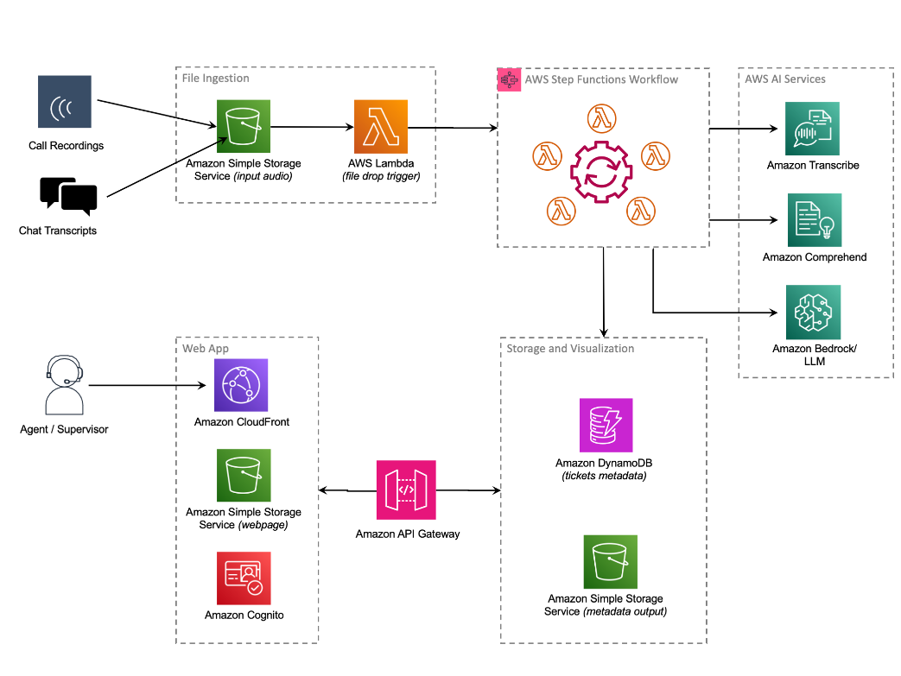
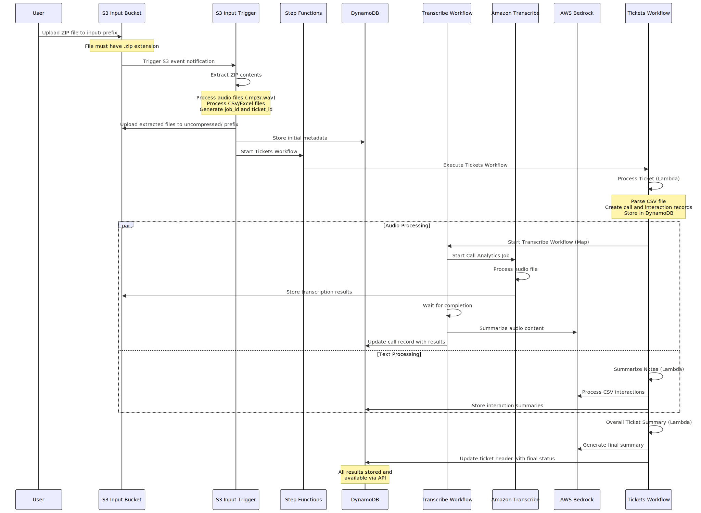

# AWS GenAI Post-Call Analytics

[](https://github.com/aws/mit-0)

A sample post call analytics solution that leverages AWS services like Amazon Transcribe to automatically convert audio to text and AI/ML services like Amazon Bedrock to analyze call recordings and extract actionable business insights. This system automatically processes audio files, generates transcriptions, performs sentiment analysis, creates quality assurance reports and detailed summaries to help organizations understand customer interactions at scale.

> **Note**: This solution is inspired by and builds upon the [Amazon Transcribe Post Call Analytics (PCA) Solution](https://github.com/aws-samples/amazon-transcribe-post-call-analytics) and [Conversation Intelligence using AI/ML on AWS](https://github.com/aws-samples/conversation-intelligence-using-aiml-on-aws) repositories.

## Table of Contents

- [Overview](#overview)
- [Architecture](#architecture)
- [Project Structure](#project-structure)
- [Deployment](#deployment)
- [Demo Usage](#demo-usage)
- [Preparing Input Zip File](#preparing-input-zip-file)
- [Cleanup](#cleanup)
- [Local Development](#local-development)
- [Contributing](#contributing)
- [Troubleshooting](#troubleshooting)
- [Related Resources](#related-resources)
- [Security] (#security)
- [License](#license)

## Overview

This sample addresses the challenge of manually analyzing customer call recordings by automating the entire process using AWS AI services. The system:

- **Ingests** audio files and interactions as a zip file through S3 bucket uploads
- **Transcribes** audio using Amazon Transcribe with speaker identification
- **Analyzes** content using AWS Bedrock for sentiment, key phrases, and insights
- **Summarizes** conversations with AI-generated executive summaries
- **Presents** results through a modern React web dashboard
- **Scales** automatically to handle varying workloads


The solution is particularly valuable for:
- Customer service teams analyzing support calls
- Sales organizations reviewing prospect conversations
- Quality assurance teams monitoring call compliance
- Business analysts extracting market insights from customer feedback


### Features

#### 🎯 **Core Capabilities**
- **Multi-Modal Analysis**: Process both audio recordings and text interactions in a unified workflow
- **AI-Powered Insights**: Leverage AWS Bedrock for advanced sentiment analysis, summarization, and key phrase extraction
- **Speaker Identification**: Automatic detection and separation of agent vs. customer speech
- **Real-time Processing**: Event-driven architecture for immediate processing upon file upload
- **Comprehensive Analytics**: Generate executive summaries, sentiment trends, and quality assurance reports

#### 🏗️ **Technical Features**
- **Serverless Architecture**: Built entirely on AWS serverless services for automatic scaling
- **Event-Driven Processing**: Step Functions orchestrate complex workflows with parallel processing
- **Multi-Format Support**: Handle ZIP archives containing multiple audio files and interaction logs
- **Flexible Input**: Support for MP3, WAV audio formats and CSV/Excel interaction logs
- **Enterprise Security**: End-to-end encryption, IAM-based access control, and audit logging

#### 📊 **Insights**
- **Customer Sentiment Tracking**: Monitor satisfaction levels and emotional trends throughout interactions
- **Agent Performance Analytics**: Evaluate communication effectiveness and identify training opportunities
- **Compliance Monitoring**: Automated quality assurance checks and regulatory compliance reporting
- **Trend Analysis**: Historical data analysis for business process improvement
- **Custom Categorization**: Flexible tagging system for interaction classification

#### 🖥️ **User Experience**
- **Modern Web Dashboard**: React-based interface with responsive design
- **Role-based Access**: Secure user authentication with Amazon Cognito

 ### **⚠️ IMPORTANT ⚠️**
> **Usage Guidelines:**
>
> You should consider doing your own independent assessment before using the content in this sample/demo for production purposes. This may include (amongst other things) testing, securing, and optimizing the content provided in this sample, based on your specific quality control practices and standards.
>
> **Cost Implications:**
> * This sample/demo utilizes multiple AWS services that will incur charges in your AWS account
> * Key services include AWS Bedrock, Amazon Transcribe, Lambda, Step Functions, and more
> * Remember to follow the cleanup instructions to avoid ongoing charges
>
> **Use of Prompt Engineering Templates:**
>
> All the prompt engineering templates are provided to you as AWS Content under the AWS Customer Agreement, or the relevant written agreement between you and AWS (whichever applies). You should not use any prompt engineering templates in your production accounts, or on production, or other critical data. You are responsible for testing, securing, and optimizing the prompt engineering templates as appropriate for production grade use based on your specific quality control practices and standards.

## Architecture



### Flow Diagram



1. **File Upload**: User uploads ZIP file to S3 `input/` prefix
2. **Trigger Activation**: S3 event notification triggers Lambda function
3. **File Processing**: Lambda extracts, validates, and uploads files
4. **Metadata Creation**: Initial records created in DynamoDB
5. **Workflow Orchestration**: Step Functions workflows initiated
6. **Parallel Processing**: Audio transcription and text analysis run concurrently
7. **Result Aggregation**: Final summaries and insights generated
8. **Status Updates**: DynamoDB updated with processing results


## Project Structure

```
├── packages/
│   ├── infra/          # AWS CDK infrastructure code
│   └── react-web/      # React web application
├── architecture/       # Architecture diagrams
```

## Deployment

### Development Environment Setup
You need a development machine or an EC2 instance with the following software installed:
* **Node.js** 18+ with Yarn package manager
* **AWS CDK CLI** (`npm install -g aws-cdk`)
* **Docker** (latest stable version)
* **AWS CLI** (configured with admin credentials)

### AWS Account Requirements
* **Admin access** to an AWS account with appropriate permissions
* **AWS CLI** properly configured with credentials
* **AWS Bedrock** access with your preferred foundation model enabled in your target region
  - Verify model access in AWS Bedrock console
  - Ensure service quotas are sufficient for your usage
* **Custom Domain Name & SSL Certificate** (Optional but highly recommended)
  - Recommended for securing API Gateway endpoints
  - Required for production-grade deployments
  - Helps avoid CORS and security issues

### CDK Project Configuration
Update the configuration through either:
* `.projenrc.ts` file (recommended if using [Projen](https://projen.io/))
* `cdk.json` file under `/packages/infra` folder

Key Configuration Parameters:
* `allowedDomains`: Specify allowed domains for API Gateway
  - Use `"*"` for development
  - Restrict to specific domains for production
* `allowCloudFrontRegionList`: List of [ISO 3166 country codes](https://en.wikipedia.org/wiki/List_of_ISO_3166_country_codes)
  - Controls geographic access to CloudFront distribution
  - Defaults to `US` and `IN` if not specified
* `stackName`: CDK stack name (default: "genai-pca-stack"). You also have an option to override the stack name while deploying the stack using CDK.
* `bedrockModelId`: Bedrock model ID or cross-region inference profile ID. Currently only default inference profiles are supported. 

### Installation Steps

1. **Install Dependencies & Build the Project**
   ```bash
   yarn install
   yarn build
   ```

2. **Deploy Infrastructure**
   
   Navigate to the infrastructure package:
   ```bash
   cd packages/infra
   ```
   
   Bootstrap CDK (first time only):
   ```bash
   yarn cdk bootstrap
   ```
   
   Deploy the stack:
   ```bash
   # Deploy with default stack name (genai-pca-stack)
   yarn cdk deploy
   
   # Or deploy with custom stack name
   yarn cdk deploy -c stackName=mystack
   ```

3. **Post-Deployment Setup**
   * Note the CDK output values (save these for reference)
   * Add users to Cognito User Pool:
     1. Locate User Pool ID from stack outputs (Key Format: `cognitocognitoUserPoolXXXXXXXX`)
     2. Navigate to AWS Cognito Console
     3. Add users as needed

4. **Access the Application**
   * Use the CloudFront Distribution URL from stack outputs
   * Or use your configured custom domain

## Demo Usage
1. **Prepare** the ZIP file as specified in the [Preparing Input Zip File](#preparing-input-zip-file) section
2. **Upload** the ZIP file through the web UI
3. **Monitor** processing status - typically takes 5-6 minutes (duration depends on audio file length)
4. **View Results** when status changes to "PROCESSED"


## Preparing Input Zip File

1. Create a zip file containing:
   * One or more audio files (MP3 or WAV format)
   * One CSV file with metadata for all audio files and email interactions between an agent and the customer

2. **CSV File Requirements:**
   * Must have at least one entry for email interaction and audio transcription
   * Must include entries for all audio files and email interactions
   
   **CSV Column Specifications (in order):**

| Column | Data Type | Usage in Ingestion Process |
|--------|-----------|----------------------------|
| **TicketID** | String | Ticket identifier used for grouping related interactions. Stored in `ticketId` field across all record types. Used for filtering and querying related interactions in DynamoDB. |
| **Role** | String | Parsed to determine `initiator` ("agent" or "user") and `initiatorId`. Format: "Agent-{name}" or "Customer". Agent names extracted by splitting on "-" and taking second part. Used for call and interaction record attribution. |
| **Datetime** | String (ISO format) | Parsed using `dateutil.parser` to extract interaction timestamp. Converted to Unix timestamp for DynamoDB storage. Used to determine ticket creation time (earliest timestamp) and sort key generation. |
| **Interaction** | String (Text) | Stored as `content` field in interaction records. Contains description of the interaction (email, note, etc.). Used for text analysis and summarization by AWS Bedrock. |
| **CallID** | String | Audio filename without extension. Example: If audio file is `20240515114525_abcd1234.mp3`, `CallID` should be `20240515114525_abcd1234` |
| **From** | String (Optional) | Contact information (email/phone) of the interaction initiator. Stored as metadata for contact tracking and communication history. Used for identifying interaction sources and participant details. |
| **Category** | String (Optional) | Classification of interaction type (e.g., "Support", "Sales", "Email", "Call"). Used for categorizing interactions and enabling filtered analysis. Stored as metadata for reporting and analytics purposes. |

   **CSV File Format (TICKET-12345.csv):**
   ```csv
   TicketID,Role,Datetime,Interaction,CallID,From,Category
   TICKET-12345,Agent-John,2024-01-15 10:30:00,Initial contact with customer,20240515114525_abcd1234,john@company.com,Support
   TICKET-12345,Customer,2024-01-15 11:00:00,Email response received,,customer@email.com,Email
   TICKET-12345,Agent-Sarah,2024-01-15 14:30:00,Follow-up call made,20240515114530_efgh5678.mp3,sarah@company.com,Support
   ```
3. Audio File Requirements:
   * Format: MP3 or WAV
   * Stereo or Multi Channel Audio files. Mono Audio files are not supported.
   * Filename pattern: `<timestamp>_<call_id>.mp3` or `<timestamp>_<call_id>.wav`
   * Example: `20240515114525_abcd1234.mp3`
     - timestamp: YYYYMMDDHHMMSS
     - call_id: unique identifier

4. **Final ZIP File Structure:**
   ```
   TICKET-12345.zip
   ├── 20240515114525_abcd1234.mp3
   ├── 20240515114530_efgh5678.mp3
   └── TICKET-12345.csv
   ```

## Cleanup

### 1. Automated Cleanup (Primary Method)

**Infrastructure Cleanup via CDK:**
```bash
cd packages/infra
npx cdk destroy
```

**Verify Stack Deletion:**
- Open AWS CloudFormation Console
- Confirm stack status shows "DELETE_COMPLETE"
- If deletion fails, check CloudFormation events for error details

### 2. Alternative Cleanup (AWS Console)

**CloudFormation Console Method:**
- Navigate to AWS CloudFormation
- Select the stack (default: "genai-pca-stack")
- Click "Delete" and confirm deletion
- Monitor deletion progress

### 3. Manual Resource Cleanup

> Some resources may require manual deletion due to retention policies or non-empty states.

**📦 S3 Buckets**
- Empty buckets before deletion
- Check both static website and transcription buckets
- Delete any remaining objects including versions/markers

**💾 Database Resources**
- DynamoDB tables (verify data backup if needed)
- Delete any manual backups or replicas

**🔐 Authentication Resources**
- Cognito User Pool and Identity Pool
- Any associated users or identity providers

**📊 Monitoring & Logging**
- CloudWatch Log Groups (especially Lambda logs)
- CloudWatch Alarms
- X-Ray traces if enabled

**🌐 Content Delivery**
- CloudFront distribution (ensure fully disabled)
- Any associated SSL certificates if manually added

### 4. Cleanup Verification

**Resource Check:**
- Search each service console mentioned above
- Verify no orphaned resources exist
- Check for resources in all regions used

**Cost Verification:**
- Monitor AWS Cost Explorer for any continuing charges
- Verify resource usage has stopped

### ⚠️ Important Notes

- Always verify cleanup in non-production environments first
- Some resources may have deletion protection enabled
- Backup any important data before cleanup
- Consider dependencies between resources during cleanup
- Monitor AWS billing for a full cycle after cleanup


## Local Development

This project uses:
- **Projen** for project configuration and management
- **NX** for monorepo orchestration and caching
- **TypeScript** for type safety
- **AWS CDK** for infrastructure as code
- **React** for the web interface

### Making changes to project configuration

1. Modify `.projenrc.ts` for project configuration changes
2. Run `yarn projen` to regenerate configuration files

### Running frontend locally

1. Install Dependencies & Build the Project
```bash
yarn install
yarn build
```

2. Deploy Backend Infrastructure
* Follow the deployment steps above
* Ensure infrastructure is deployed before proceeding

3. Configure Frontend
* Locate the aws-config.js file in the frontend S3 bucket
  - Bucket name available in stack outputs
  - Key format: `sitestaticWebsiteBucketXXXXXXXX`
* Copy aws-config.js to `/packages/react-web/public/`

4. Start Development Server
```bash
cd packages/react-web
yarn start
```

## Contributing

See [CONTRIBUTING](CONTRIBUTING.md) for more information.


## Troubleshooting

### 🔍 **Common Issues**

#### **Deployment Failures**
- **CDK Bootstrap**: Ensure CDK is bootstrapped in your target region
- **Permissions**: Verify AWS credentials have sufficient permissions
- **Quotas**: Check service limits for Lambda, Transcribe, and Bedrock

#### **Processing Issues**
- **File Format**: Ensure audio files are in supported formats (MP3, WAV)
- **CSV Structure**: Verify CSV columns match required specification
- **File Size**: Check file size limits for Lambda and S3


## Related Resources

### 📚 **AWS Documentation**
- [Amazon Transcribe Developer Guide](https://docs.aws.amazon.com/transcribe/)
- [AWS Bedrock User Guide](https://docs.aws.amazon.com/bedrock/)
- [AWS Step Functions Developer Guide](https://docs.aws.amazon.com/step-functions/)
- [AWS CDK Developer Guide](https://docs.aws.amazon.com/cdk/)

### 🔗 **Related Solutions**
- [Amazon Transcribe Post Call Analytics](https://github.com/aws-samples/amazon-transcribe-post-call-analytics)
- [Conversation Intelligence using AI/ML on AWS](https://github.com/aws-samples/conversation-intelligence-using-aiml-on-aws)

### 📋 **Contribution Guidelines**
- Follow existing code style and conventions
- Update documentation as needed

## Security

See [CONTRIBUTING](CONTRIBUTING.md#security-issue-notifications) for more information.

## License

This project is licensed under the MIT-0 License - see the [LICENSE](LICENSE) file for details.
