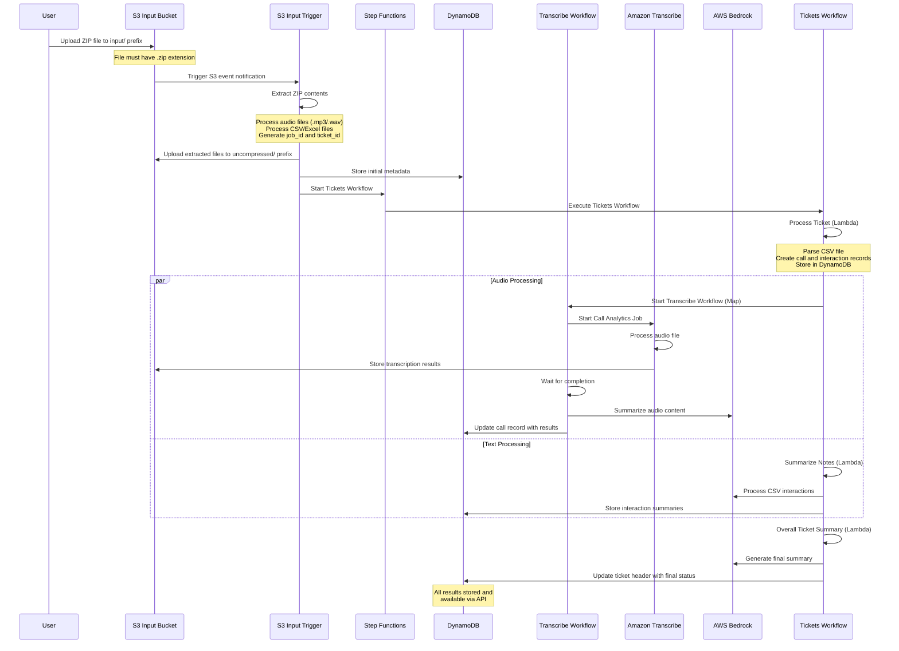

# Data Ingestion Flow - Sequence Diagram

```mermaid
sequenceDiagram
    participant User
    participant S3 as S3 Input Bucket
    participant Lambda as S3 Input Trigger
    participant SF as Step Functions
    participant DDB as DynamoDB
    participant TSF as Transcribe Workflow
    participant Transcribe as Amazon Transcribe
    participant Bedrock as AWS Bedrock
    participant TF as Tickets Workflow

    User->>S3: Upload ZIP file to input/ prefix
    Note over S3: File must have .zip extension
    S3->>Lambda: Trigger S3 event notification
    
    Lambda->>Lambda: Extract ZIP contents
    Note over Lambda: Process audio files (.mp3/.wav)<br/>Process CSV/Excel files<br/>Generate job_id and ticket_id
    
    Lambda->>S3: Upload extracted files to uncompressed/ prefix
    Lambda->>DDB: Store initial metadata
    Lambda->>SF: Start Tickets Workflow
    
    SF->>TF: Execute Tickets Workflow
    TF->>TF: Process Ticket (Lambda)
    Note over TF: Parse CSV file<br/>Create call and interaction records<br/>Store in DynamoDB
    
    par Audio Processing
        TF->>TSF: Start Transcribe Workflow (Map)
        TSF->>Transcribe: Start Call Analytics Job
        Transcribe->>Transcribe: Process audio file
        Transcribe->>S3: Store transcription results
        TSF->>TSF: Wait for completion
        TSF->>Bedrock: Summarize audio content
        TSF->>DDB: Update call record with results
    and Text Processing
        TF->>TF: Summarize Notes (Lambda)
        TF->>Bedrock: Process CSV interactions
        TF->>DDB: Store interaction summaries
    end
    
    TF->>TF: Overall Ticket Summary (Lambda)
    TF->>Bedrock: Generate final summary
    TF->>DDB: Update ticket header with final status
    
    Note over DDB: All results stored and<br/>available via API
```